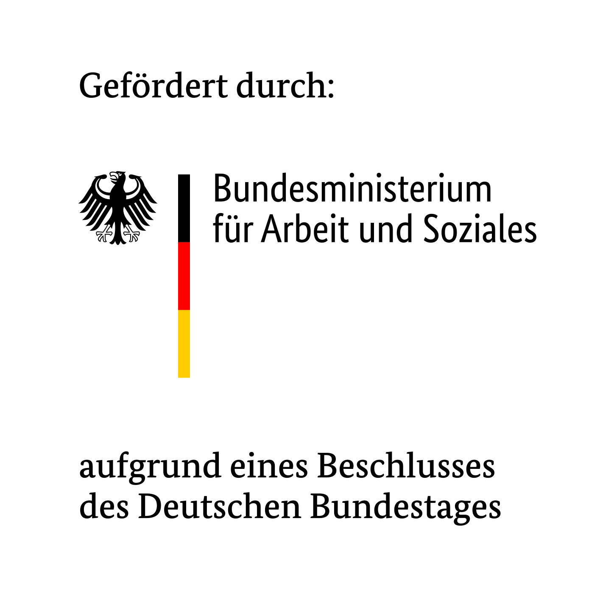

# Starwits implementation of AI Cockpit transparency API
Complex software systems that uses AI mechanisms are difficult to understand. This API is part of an effort to add transparency and control to such systems. It is Starwit Technologies' implementation of the transparency interface. It shall provide statistical insights to an AI system's capabilities and give users an easy as possible way to understand, how this system work.

API reference can be found here: https://gitlab.opencode.de/ki-cockpit/ai-cockpit-api/-/blob/main/api/transparency/ai-cockpit-transparency.yml?ref_type=heads


More details can be found at <https://www.kicockpit.eu/>. All shared components necessary for this repo can be found [here](https://github.com/KI-Cockpit/ai-cockpit-api). There you also can find more info about all other activities & results of this project.


## Overview
This implementation aims to be a micro service, that can be deployed into a system landscape, that contains complex AI-based decision mechanism. It is written in Java / Spring Boot and was initially generated by the [OpenAPI Generator](https://openapi-generator.tech) project. 

## Starwit's implementation

This component is part of Starwit's implementation for an AI Cockpit. For an overview of all components see [deployment repo](https://github.com/starwit/ai-cockpit-deployment).

## Run Docker image

    docker run -it -p 8080:8080 starwit-aicapi-transparency

Once running you can access:
* interactive API at http://localhost:8080/swagger-ui.html
* API spec at: http://localhost:8080/v0/api-docs/

## Build & run locally

```bash
    mvn package
    java -jar target/starwit-aicapi-transparency-x.y.z.jar
```

The specification is available to download using the following url:
http://localhost:8080/v0/api-docs/


You can view the api documentation in swagger-ui by pointing to
http://localhost:8080/swagger-ui.html

### Config file

```properties
# sets URL for swagger UI
app.service_uri=http://localhost:8080

# URL for cockpit
cockpit.hostname=http://localhost:8081/ai-cockpit/ 
# context path module API
cockpit.moduleapi=api/module
# context path AIC functions
cockpit.aicapi=api/aic/modules 

# if true sample data will be send to cockpit
scenario.setup=true 
# if internal prepackaged data will be imported else folder location
scenario.importFolder=internal 

# Authentication against IdP
cockpit.auth.enabled=true
cockpit.auth.client_id=aicockpit
cockpit.auth.username=username 
cockpit.auth.password=secret 
cockpit.auth.url=https://hostname/auth/realms/default/protocol/openid-connect/token
```

## Contact & Contribution

The “KI-Cockpit” (AI Cockpit) project was funded by the Federal Ministry of Labor and Social Affairs and executed by the nexus Institute, Aalen University, the University of Stuttgart, Chemistree, Caritas Dortmund & Starwit Technologies with the support of Awesome Technologies Innovationslabor, the Institute for Innovation and Technology (iit) at VDI/VDE Innovation + Technik and keytec.



## License
This software is licensed under AGPL and license text can be found at: https://github.com/starwit/starwit-aic-transparency-api/blob/main/LICENSE

More info about Starwit can be found here: https://starwit-technologies.de/